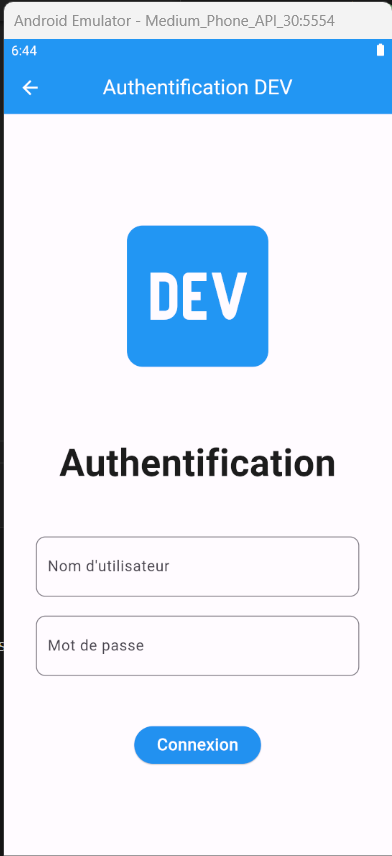
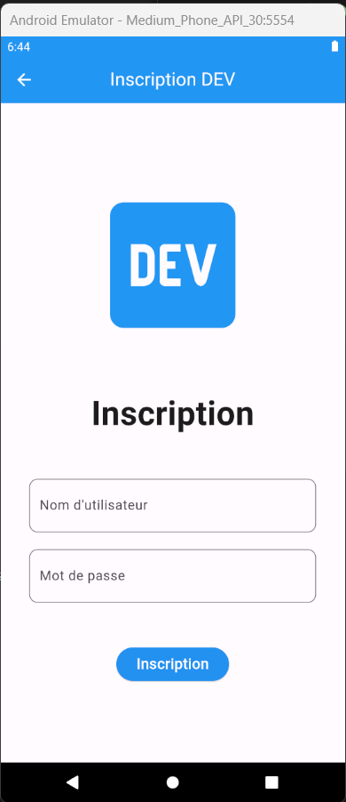
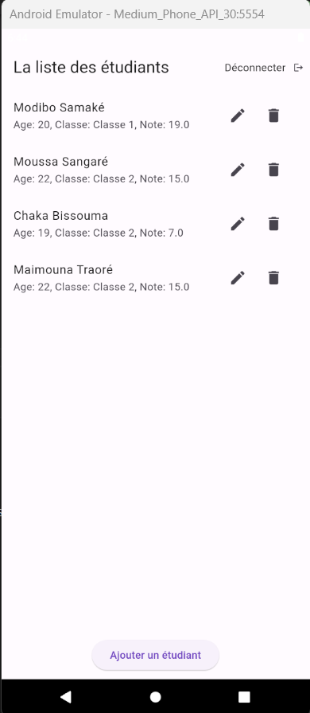
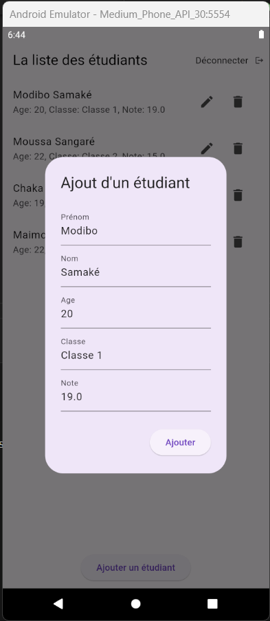
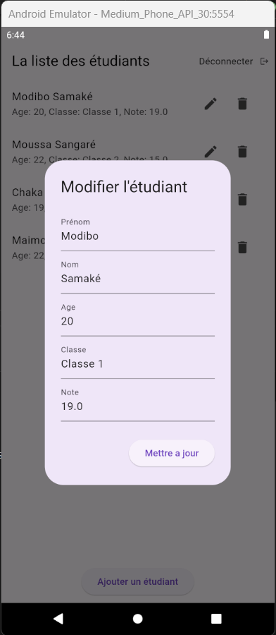

# DEV

DEV est une application Flutter qui permet aux utilisateurs de gérer les informations des étudiants, y compris la connexion, l'inscription et la visualisation d'une liste d'étudiants.

## Captures d'écran

### Page de Connexion

*Description: Il s'agit de la page de connexion où les utilisateurs peuvent saisir leurs identifiants pour se connecter.*

---

### Page d'Inscription

*Description: La page d'inscription permet aux utilisateurs de créer un nouveau compte en fournissant les détails nécessaires.*

---

### Page des Étudiants

*Description: La page des étudiants affiche une liste d'étudiants, et les utilisateurs peuvent ajouter, supprimer et mettre à jour les informations des étudiants.*

---

### Page d'ajout d'Étudiant

*Description: Affiche un dialog (Modal) avec les informations d'étudiants à saisir pour l'ajouter au liste des des étudiants.*

---

### Page de mise à jour d'Étudiant

*Description: Affiche un dialog (Modal) avec les informations d'étudiants à modifier pour mettre à jour les informations de l'étudiant.*

## Fonctionnalités

- **Connexion**: Les utilisateurs peuvent se connecter en utilisant leurs identifiants.
- **Inscription**: Les nouveaux utilisateurs peuvent créer un compte en fournissant leurs détails.
- **Voir les Étudiants**: Les utilisateurs peuvent voir une liste d'étudiants avec leurs détails.
- **Ajouter un Étudiant**: Les utilisateurs peuvent ajouter un nouvel étudiant à la liste.
- **Supprimer un Étudiant**: Les utilisateurs peuvent supprimer un étudiant de la liste.
- **Modifier un Étudiant**: Les utilisateurs peuvent modifier les informations d'un étudiant existant.
